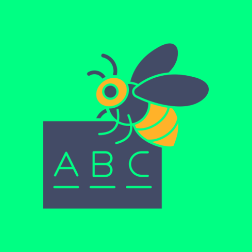

# 🎓 Đánh Vần - Ứng dụng học đánh vần tiếng Việt cho trẻ em

<p align="center">
  
</p>

## 📱 Giới thiệu

**Đánh Vần** là một ứng dụng Android giúp trẻ em học đánh vần tiếng Việt thông qua các chế độ chơi tương tác và hình ảnh sinh động. Ứng dụng được thiết kế đặc biệt cho trẻ nhỏ với giao diện thân thiện và nhiều cơ chế khích lệ học tập.

## ✨ Tính năng chính

### 🎮 Các chế độ chơi
- **Khám Phá (Explore Mode)**: Xem hình ảnh, nghe phát âm và học cách đánh vần từng từ
- **Ghép Từ (Spelling Mode)**: Ghép các âm tiết để tạo thành từ hoàn chỉnh
- **Trắc Nghiệm (Quiz Mode)**: Chọn từ đúng theo hình ảnh
- **Điền Khuyết (Fill-in Mode)**: Điền từ còn thiếu vào chỗ trống
- **Lật Hình (Memory Mode)**: Trò chơi ghi nhớ ghép cặp từ và hình

### 🏷️ Chủ đề học tập đa dạng
- Động vật (Con mèo, con chó, con voi...)
- Nghề nghiệp (Bác sĩ, giáo viên, kỹ sư...)
- Trái cây (Quả táo, quả cam, quả xoài...)
- Rau củ (Rau muống, cà chua, khoai tây...)
- Đồ vật (Cái bàn, cái ghế, tivi...)
- Gia đình (Bố, mẹ, ông, bà...)
- Trường học (Thầy giáo, cặp sách, bút...)
- Thiên nhiên (Mặt trời, núi, biển...)
- Màu sắc & Số đếm
- Và nhiều chủ đề khác...

### 🌟 Hệ thống phần thưởng
- ⭐ Thu thập sao sau mỗi bài học thành công
- 🎰 Vòng quay may mắn (Lucky Spin)
- 🎁 Nhận thưởng hàng ngày
- 🛒 Cửa hàng mua sticker và theme
- 📖 Sách sticker để trang trí

### 👨‍👩‍👧 Chế độ phụ huynh
- Quản lý từ vựng tùy chỉnh
- Import/Export dữ liệu từ JSON
- Sao lưu và khôi phục dữ liệu
- Thống kê tiến độ học tập

## 🛠️ Công nghệ sử dụng

| Công nghệ | Mô tả |
|-----------|-------|
| **Kotlin** | Ngôn ngữ lập trình chính |
| **Jetpack Compose** | Framework UI hiện đại |
| **Material 3** | Design system |
| **Room Database** | Lưu trữ dữ liệu cục bộ |
| **Coil** | Tải và hiển thị hình ảnh |
| **Gson** | Parse JSON data |
| **Text-to-Speech (TTS)** | Phát âm từ vựng |
| **Speech Recognition** | Nhận dạng giọng nói |

## 📋 Yêu cầu hệ thống

- **Android SDK**: API 24+ (Android 7.0 Nougat trở lên)
- **Target SDK**: 34 (Android 14)
- **Kotlin**: 1.9.x
- **Gradle**: 8.x

## 🚀 Cài đặt & Chạy

### Clone repository
```bash
git clone https://github.com/your-username/gamedanhvan.git
cd gamedanhvan
```

### Build với Gradle
```bash
# Build debug APK
./gradlew assembleDebug

# Build release APK
./gradlew assembleRelease
```

### Mở trong Android Studio
1. Mở Android Studio
2. Chọn **File > Open**
3. Chọn thư mục dự án
4. Đợi Gradle sync hoàn tất
5. Nhấn Run (Shift + F10)

## 📦 Cấu trúc dữ liệu

### Định dạng từ vựng (JSON)
```json
[
    {
        "text": "Con Mèo",
        "category": "Động vật"
    },
    {
        "text": "Quả Táo",
        "category": "Hoa quả"
    }
]
```

### Import từ vựng tùy chỉnh
1. Vào chế độ **Phụ huynh** (Parent Mode)
2. Chuẩn bị file JSON theo định dạng trên
3. Chọn **Import JSON** và chọn file

## 🔐 Quyền ứng dụng

| Permission | Mục đích |
|------------|----------|
| `INTERNET` | Tải hình ảnh từ mạng |
| `READ_EXTERNAL_STORAGE` | Đọc file backup/import |
| `WRITE_EXTERNAL_STORAGE` | Lưu file backup/export |
| `RECORD_AUDIO` | Nhận dạng giọng nói |

## 📄 License

Dự án này được phát triển cho mục đích giáo dục.

## 👨‍💻 Tác giả

**Skul9x**

---

<p align="center">
  Made with ❤️ for Vietnamese children's education
</p>
